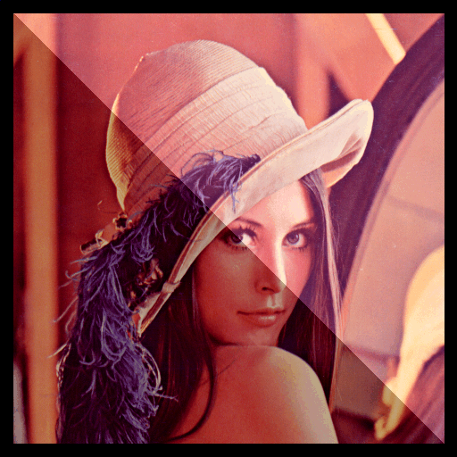
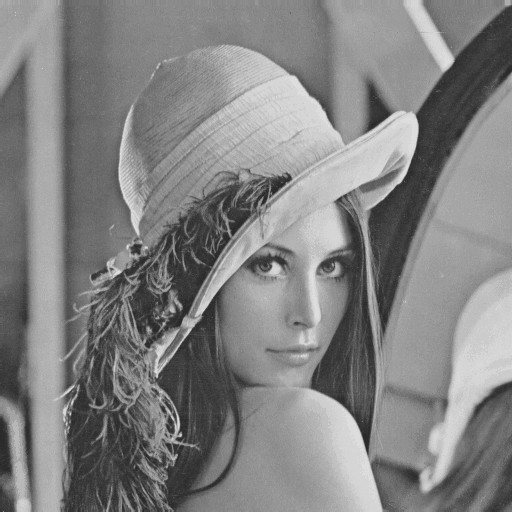
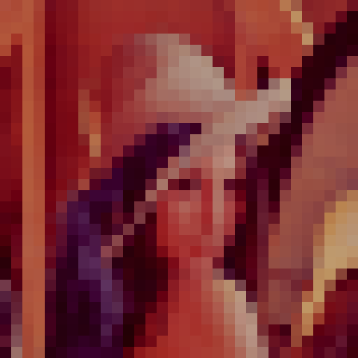
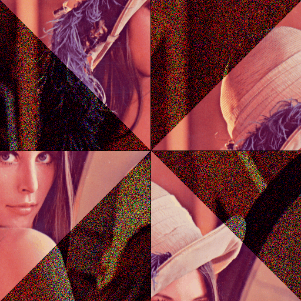
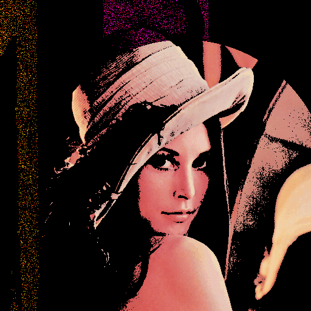
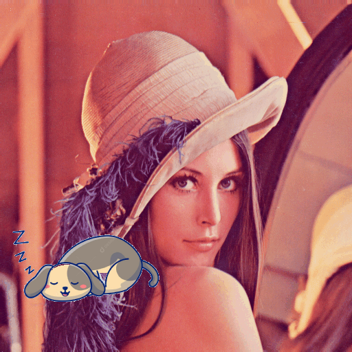

# Manipulação de Imagem com C

---

Neste repositório, apresentamos uma coleção de filtros e efeitos para manipulação de imagens utilizando a linguagem de programação C. Com uma abordagem simples e eficaz, você poderá aplicar diversos efeitos em imagens no formato BMP, proporcionando uma experiência de aprendizado prática e envolvente.

## Proposta do Repositório


Tente usar o modelo presente em `Estrutura Básica` para configurar o seu `main.c`. Para entender, use manipulações simples, aplicando lógicas de manipulações em matrizes bidimensionais ou tridimensionais com o padrão `i, j, k`. Use o meu modelo de exemplo para criar suas próprias manipulações todos os arquivos presentes em `photoshop em c`.

<br>

## Sumário

- [Bibliotecas Utilizadas](#bibliotecas-utilizadas)
- [Estrutura Básica](#estrutura-básica)
- [Exemplo de Manipulação](#exemplo-de-manipulação)
- [Detalhes do Repositório](#detalhes-do-repositório)
- [Caso 'A': Proposto](#caso-a-proposto)
    - [1. Bordas](#bordas)
    - [2. Inverter Imagem](#inverter-imagem)
- [Caso 'B': Efeitos](#caso-b-efeitos)
    - [1. Intensificar Cor](#1-intensificar-cor)
    - [2. Zoom e Multiplicar Imagem](#2-zoom-e-multiplicar-imagem)
    - [3. Preto & Branco com Intensidade & Noise](#3-preto--branco-com-intensidade--noise)
    - [4. Cor Inversa - (R, B, G) e Nível de Brilho](#4-cor-inversa---r-b-g-e-nível-de-brilho)
    - [5. Pixelado](#5-pixelado)
    - [6. Fragmentado com Ruído](#6-fragmentado-com-ruído)
    - [7. Noise-Retro, TV Antiga](#7-noise-retro-tv-antiga)
    - [8. Borrão](#8-borrão)
    - [9. Sobrepor Imagem](#9-sobrepor-imagem)

---

## Bibliotecas Utilizadas

Para manipular imagens em C, utilizamos as bibliotecas `libbmp` e `imghelpers`. Essas bibliotecas fornecem funções para carregar, salvar e processar imagens BMP.

Para usar este repositório, utilize a biblioteca:

<a href="">  </a>

## Estrutura Básica

Inclua as seguintes referências no seu arquivo principal `main.c`:

```c
#include <stdio.h>
#include "libs/libbmp.h"
#include "libs/imghelpers.h"

int main() {
  // Utilize apenas imagens .bmp com o formato 24 (true color)
  bmp_img img;
  char filename[] = "exemplo.bmp"; // nome do arquivo da imagem
  printf("\n");
  IMG_TAM t = pegarTamanho(filename);
  int l = t.qtdLinhas, c = t.qtdColunas;
  int R[l][c], G[l][c], B[l][c];
  carregaImagem(t, R, G, B, filename);

  // manipule sua imagem aqui.
  for(int i = 0; i < l; i++) {
    for(int j = 0; j < c; j++) {
      if(R[i][j] > 150) R[i][j] = 0;
    }
  }
  
  // Exemplo: zerar todos os pixels azuis acima de 120
  salvaImagem(t, R, G, B, "saida.bmp");
  mostrarNoReplit("saida.bmp");
  return 0;
}
```

### Exemplo de Manipulação

A seguir, apresentamos um exemplo mais completo de manipulação de imagem utilizando diversos efeitos e filtros:

<br>

<div style="text-align: center;">


</div>

<br>

Como pode ser visto acima, a imagem recebe diferentes filtros através de uma seleção em loop do menu.

Veja e use por si mesmo, <a href="https://replit.com/@PedroCezar2/aula">aqui!</a>

---

## Detalhes do Repositório

Imagem padrão:


## Filtros Utilizados

Neste repositório, você encontrará funções que aplicam diversos filtros e efeitos em imagens. Abaixo, uma descrição detalhada de cada opção disponível no menu e os efeitos correspondentes.

## Caso 'A': Proposto

### Bordas

Se o usuário escolher a opção 1 após selecionar 'A', a imagem receberá uma borda de tamanho especificado pelo usuário. A função pede para o usuário fornecer o tamanho da borda e aplica o efeito na imagem, tornando os pixels na borda pretos.



### Inverter Imagem

Se o usuário escolher a opção 2 após selecionar 'A', a imagem será invertida horizontalmente. Cada pixel é trocado com seu correspondente do lado oposto da imagem.


## Caso 'B': Efeitos

### 1. Intensificar Cor

Nesta opção, o usuário pode selecionar uma cor (R, G ou B) para ser intensificada na imagem. Também é possível personalizar a intensidade da cor escolhida, resultando em um efeito visual mais vibrante.


### 2. Zoom e Multiplicar Imagem

Esta opção permite ao usuário aplicar um efeito de zoom na imagem e multiplicá-la em várias cópias menores, ajustadas conforme o deslocamento especificado. O resultado é uma composição dinâmica e envolvente da imagem original.


### 3. Preto & Branco com Intensidade & Noise

Converte a imagem para preto e branco com uma intensidade especificada pelo usuário e adiciona um efeito de "ruído" para criar uma aparência vintage. Isso resulta em uma estética clássica e atemporal, evocando memórias de imagens antigas.

 

### 4. Cor Inversa - (R, B, G) e Nível de Brilho

Inverte as cores da imagem e ajusta o nível de brilho conforme especificado pelo usuário. Essa manipulação cria um contraste marcante, alterando completamente a percepção da imagem original.


### 5. Pixelado

Transforma a imagem em uma versão pixelada. O usuário pode escolher o tamanho dos pixels, seguindo um modelo de progressão. Essa técnica oferece um visual nostálgico, reminiscentes dos primeiros jogos eletrônicos.



### 6. Fragmentado com Ruído

Neste efeito, a imagem é dividida em quatro quadrantes, e cada quadrante é manipulado de forma a criar um efeito fragmentado. Além disso, ruídos aleatórios são aplicados nas cores dos pixels, resultando em um visual distorcido e interessante. A função `rand()` gera valores aleatórios que alteram as intensidades das cores RGB dependendo das posições dos pixels.



### 7. Noise-Retro, TV Antiga

Este efeito simula a aparência de uma TV antiga, onde a imagem apresenta um ruído característico. A lógica envolve a comparação entre os valores de cor dos pixels adjacentes, e um ruído aleatório é adicionado a cada canal de cor (R, G ou B). O resultado evoca a sensação de desintegração e imperfeição, reminiscentes de transmissões antigas.

 

### 8. Borrão

O efeito de borrão suaviza a imagem, criando uma aparência desfocada. O usuário pode especificar o nível de borrão, que determina a área de pixels a serem considerados para o cálculo da média das cores. Essa operação resulta em um efeito de suavização, útil para criar uma estética artística ou ocultar detalhes.


### 9. Sobrepor Imagem

Esta opção permite ao usuário sobrepor uma imagem em outra, criando efeitos interessantes de composição. A lógica se baseia na análise da distância entre os pixels em relação ao centro da imagem, aplicando manipulações específicas dependendo da distância, o que resulta em diferentes zonas de sobreposição e alteração de cores.



---

**Trabalho feito no meu segundo período.** <br>
Sugerido pelo professor: <a href="https://www.linkedin.com/in/raphael-abreu/">Raphael Abreu</a>, onde deveria fazer um filtro e as manipulações propostas, sendo borda e inversão da imagem.
